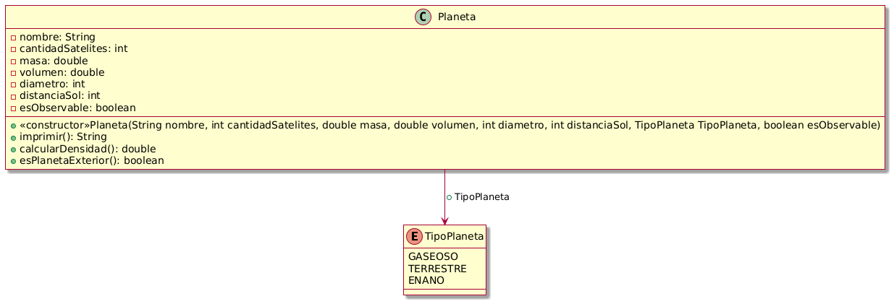

# Java_9th_Exercise_SistSolar

mkdir Java_9th_Exercise_SistSolar 
cd Java_9th_Exercise_SistSolar 
mkdir -p src/main/java/com/example/sistsolar/model 
mkdir -p src/main/java/com/example/sistsolar/service 
mkdir -p src/main/java/com/example/sistsolar/enums 
mkdir -p src/test/java/com/example/sistsolar/service 

Enunciado:
Requisitos:
La clase planeta deberá estar testeada. 
El Readme deberá mostrar el diagrama de clases

Entregables:
Repositorio de Github
.

# Estructura del Proyecto
Java_9th_Exercise_SistSolar/ 
├── src/ 
│   ├── main/ 
│   │   ├── java/ 
│   │   │   └── com/ 
│   │   │       └── example/ 
│   │   │          └── sistsolar/ 
│   │   │          ├── enums/ 
│   │   │          │   └── TipoPlaneta.java 
│   │   │          ├── model/ 
│   │   │          │   └── Planeta.java 
│   │   │          ├── service/ 
│   │   │          │   └── SistSolarService.java 
│   │   │          └── Main.java 
│   └── test/ 
│       ├── java/ 
│       │   └── com/ 
│       │       └── example/ 
│       │          └── sistsolar/ 
│       │              ├── model/ 
│       │              │     └── PlanetaTest.java 
│       │              ├── service/ 
│       │              │     └── SistSolarServiceTest.java 
│       │              └── MainTest.java 
├── .vscode/ 
│   └── settings.json 
├── .gitignore 
├── pom.xml 
└── README.md 
└── UML/ 
    └── Diagrama_de_Clases.png 

# Diagrama de Clases
[UML]https://www.planttext.com/

# Texto Enunciado:
[Link Enunciado Sistema Solar]https://docs.google.com/document/d/1e9dyJc0oAV3kZGYQsg2O4nZqwdoxbLsjiSWlOz6AWX0/edit#heading=h.yq1xiipbqwgr